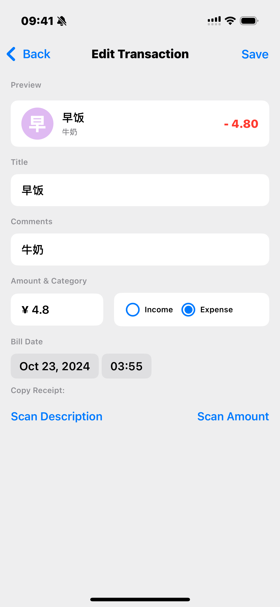

# mybills

## Application Description

mybills is a expense tracker app designed to help users easily track their spending. Users can manually log their transactions or use the app's receipt scanning feature to automatically capture and record individual items.

## Tech Stack

- **Language**: Swift
- **Development Environment**: Xcode
- **Frontend**: SwiftUI
- **Backend**: SwiftData
- **Libraries Used**:  
  - Vision (Recognizes and extracts the text from the captured image)  
  - VisionKit (Captures a receipt photo using the camera.)

## Installation Steps

Since the app is not published on the App Store, follow the steps below to run it locally:

**1. Install [Xcode](https://developer.apple.com/xcode/) (version 15 or later).**

**2. Clone the repository to your local machine.**

**3. Open the project in Xcode.**

**4. Run the app on a physical Apple device.**

*Note: As the app requires camera access for the receipt scanning feature, it cannot be used on a simulator. You must install the app on a physical Apple device to fully utilize all features.*

## Permissions
In order to use the receipt scanning feature, the app will require access to the camera.

## Screen Shot

  

    
    
<strong>[Home Page]</strong>

  

  

    
    
<strong>[Transaction Page]</strong>

  

